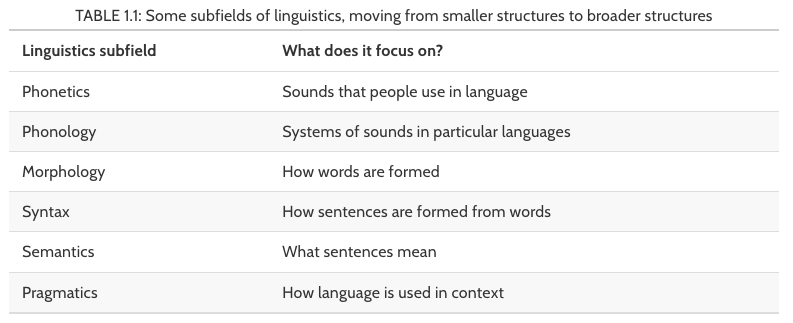
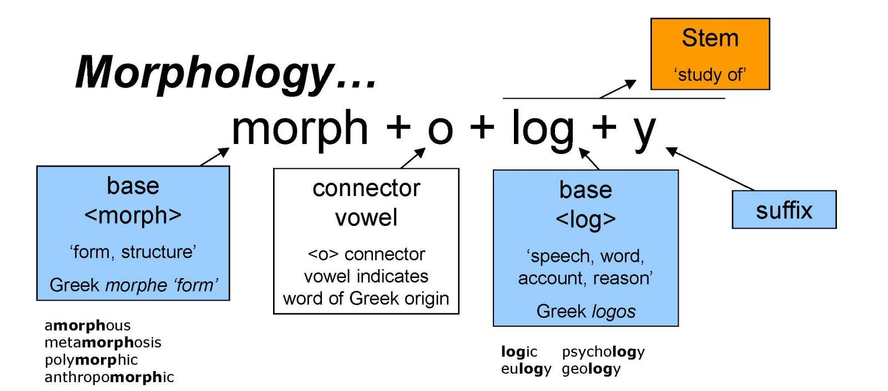

# Language and modeling

**Learning objectives:**

- Understand subfields of linguistics.
- Describe how morphology plays a role in text modeling.
- Understand the limitation of different languages.
- Understand how text can vary.

## Linguistics for Text Analysis



Understanding this hierarchy will help create *natural language features*. For example:    
- using a text that has been broken into sequences of characters for recurrent neural network - *morphology*
- utilizing the part of speech information as features - *syntax*
  
Most linguists view speech as primary to written language (technological). Analyzing written text can be limiting as it is less "creative" and more abstract.

## A Glimpse into Morphology

> The study of words, their internal structures and how they are formed




- English has a pretty low ratio of morphemes (smallest unit of part of a word with meaning)  
  - eg "un-", "break", "-able"
- Understanding morphological characteristics are beneficial for pre-processing, removing stopwords, and end stemming

## Different Languages

**Remember, English is NOT the only language**

*BenderRule* : acknowledge that the models being built are typically language-specific.  
- neglecting to state the language may give a false veneer of language-independence to the work
  
Thusly, most text used for modeling henceforth will be in English.

## Other Ways Text can Vary

- Dialects (e.e AAVE & detecting hate speech)  
- Evolution of language  
- Usage of slang

Like ML in general, text modeling is very sensitive to the data used for training!


## Meeting Videos

### Cohort 1

`r knitr::include_url("https://www.youtube.com/embed/VIhrd7LqxFk")`

<details>
<summary> Meeting chat log </summary>

```
(somewhat ironically, there was no text log for this meeting)
```
</details>
