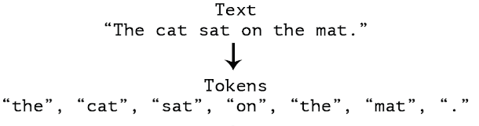
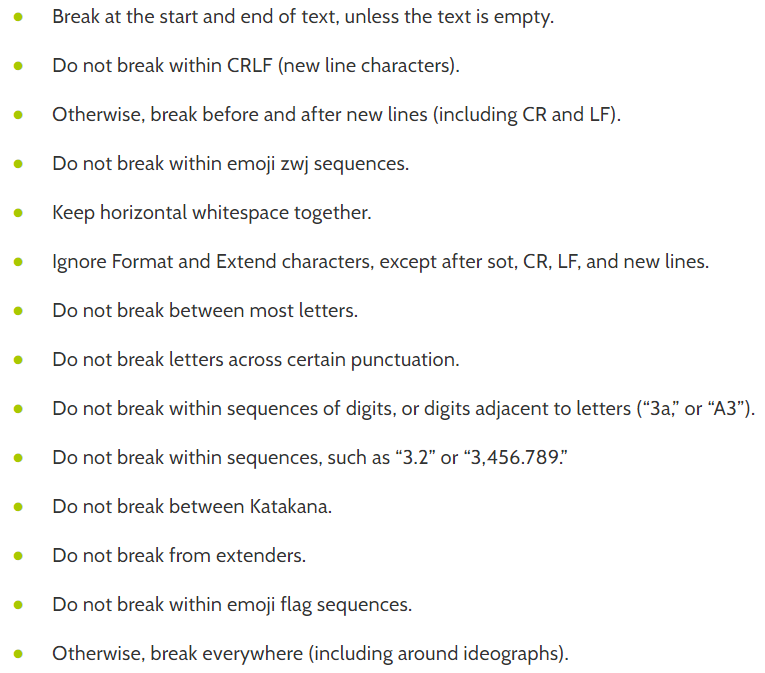
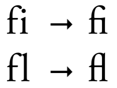
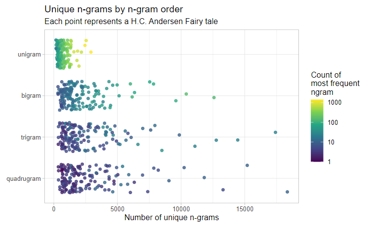

# Tokenization

**Learning objectives:**

- Define "Token"
- Different types of tokens
- Where does tokenization break down?
- Building your own tokenizer

## Define "Token"

In tokenization, we take an **input text**, and break it up into **pieces** of **meaningful sizes**. We refer this pieces of texts as tokens.



Most commonly, input texts are broken up into words. But this isn't perfect.

- No white space in certain languages (她是我最好的朋友。- 'she is my best friend' in Mandarin)
- Pronouns/negation words (Je n’aime pas le chocolat - 'I don't like chocolate' in French)
- Contractions of two words (would've, didn't)

Knowing this, let's take a jab at tokenization. We'll split on anything that is not an alphanumeric character.

```{r 02-simple-tokenization, warning = FALSE, message = FALSE}
library(tidyverse)
library(hcandersenr)

the_fir_tree <- hcandersen_en %>%
  filter(book == "The fir tree") %>%
  pull(text)

head(the_fir_tree, 9)

strsplit(the_fir_tree[1:2], "[^a-zA-Z0-9]+")
```

This is pretty good, but the hero's name (fir-tree) has been split. This kind of information loss can be dangerous, and we need to use more delicate splitting methods, rather than brute-forcing with regex.

Luckily, you don't have to write all the custom logics yourself! This chapter introduces `tokenizers`

```{r 02-tokenizers_intro, warning = FALSE, message = FALSE}
library(tokenizers)
tokenize_words(the_fir_tree[1:2])
```

The word-level tokenization in this package is done by finding word boundaries, which follows a number of sophisticated rules. 



## Different types of tokens

We can tokenize texts at a variety of units including:

- characters
- words
- sentences
- lines
- paragraphs
- n-grams

Let's explore how `tokenizers` handle these. 

```{r 02-tokenize_words}
sample_vector <- c("Far down in the forest",
                   "grew a pretty little fir-tree")
sample_tibble <- tibble(text = sample_vector)

tokenize_words(sample_vector)
```

`tidytext::unnest_tokens` does the same thing, but in a different data structure. Under the hood, it uses `paste0("tokenize_", token)` from the tokenizers package.

```{r 02-unnest_tokens}
library(tidytext)
sample_tibble %>%
  unnest_tokens(word, text, token = "words")
```

You can pass in arguments used in `tokenize_words()` through `unnest_tokens()` using ...

```{r 02-tokenizers_dots}
sample_tibble %>%
  unnest_tokens(word, text, token = "words", strip_punct = FALSE)
```

### Token type: Character

`tokenize_characters()` splits the text into letters. If strip_non_alphanum is TRUE, it strips all [:punct:] & [:whitespace:] before doing the the word boundaries.

```{r 02-tokenize_characters}
tft_token_characters <- tokenize_characters(x = the_fir_tree,
                                            lowercase = TRUE,
                                            strip_non_alphanum = TRUE,
                                            simplify = FALSE)

head(tft_token_characters) %>%
  glimpse()
```

The same thing in `unnest_tokens()`

```{r 02-tokenize_characters_unnest_tokens}
tibble(text = the_fir_tree) %>% 
  unnest_tokens(word, text, token = "characters")
```

Watch out for ligatures!

Ligatures are when multiple letters are combined as a single character.

```{r 02-ligatures}
tokenize_characters("straße")
```

- Is it a meaningful feature to keep?
- Is is sylistic or functional?



> "Wie trinken die Schweizer Bier? – In Massen." ("How do the Swiss drink beer? – In mass" instead of other meaning if it had been written as "in Maßen": "in moderation")

### Token type: Word

We've already seen this before, but chaining this with dplyr can result in interesting analyses.

```{r 02-tokenize-words-2books}
hcandersen_en %>%
  filter(book %in% c("The fir tree", "The little mermaid")) %>%
  unnest_tokens(word, text) %>%
  count(book, word) %>%
  group_by(book) %>%
  arrange(desc(n)) %>%
  slice(1:5)
```

### Token type: n-grams

A continuous sequence of *n* items. (syllables, letters, words, ...)

- unigram: “Hello,” “day,” “my,” “little”
- bigram: “fir tree,” “fresh air,” “to be,” “Robin Hood”
- trigram: “You and I,” “please let go,” “no time like,” “the little mermaid”

n-grams can capture meaningful word orders that can otherwise be lost. ("fir tree") It does so, by sliding across the text, to create overlapping sets of tokens.

```{r 02-tokenize-ngrams}
tft_token_ngram <- tokenize_ngrams(x = the_fir_tree,
                                   lowercase = TRUE,
                                   n = 3L,
                                   n_min = 3L,
                                   stopwords = character(),
                                   ngram_delim = " ",
                                   simplify = FALSE)

tft_token_ngram[[1]]
```

Using unigram is fast, but lose some information. Using higher n-grams keeps more information, but token counts decrease. You have to balance this trade off.



You can of course, tokenize many n-grams in the same place, by using `n` & `n_min` parameters.

```{r 02-tokenize-ngrams-nmin}
tft_token_ngram <- tokenize_ngrams(x = the_fir_tree,
                                   n = 2L,
                                   n_min = 1L)
tft_token_ngram[[1]]
```

This is beneficial, because unigrams would capture the frequency of the words, and the bigrams would supplement the meaning of tokens, that unigrams didn't catch.

### Token type: Lines, sentence, and paragraph

These rather large token types are rarely used for modelling purposes. The common approach for these, is to collapse all strings into one giant string, and split them using a delimeter.

#### Chapters/paragraphs 

```{r 02-tokenize_paragraphs}
add_paragraphs <- function(data) {
  pull(data, text) %>%
    paste(collapse = "\n") %>%
    tokenize_paragraphs() %>%
    unlist() %>%
    tibble(text = .) %>%
    mutate(paragraph = row_number())
}

library(janeaustenr)

northangerabbey_paragraphed <- tibble(text = northangerabbey) %>%
  mutate(chapter = cumsum(str_detect(text, "^CHAPTER "))) %>%
  filter(chapter > 0,
         !str_detect(text, "^CHAPTER ")) %>%
  nest(data = text) %>%
  mutate(data = map(data, add_paragraphs)) %>%
  unnest(cols = c(data))

glimpse(northangerabbey_paragraphed)
```

#### Sentences

Convert `the fir tree` from "one line per element" to "one line per sentence".

```{r 02-tokenize_sentences}
the_fir_tree_sentences <- the_fir_tree %>%
  paste(collapse = " ") %>%
  tokenize_sentences()

head(the_fir_tree_sentences[[1]])
```

## Where does tokenization break down?

Tokenization is a crucial first step to any kind of text analysis. Defaults work well for the most part, but we do have to make decisions carefully.

> Don’t forget you owe the bank $1 million for the house.

- **Don't**: 1 word? or "do" & "n't"?
- **$1** & **.**: strip_punct?

Context matters.

On Twitter, you'll run into grammatically incorrect sentences with multiple spaces, deliberate capitalization, different styles, ... You may not be worried, if you're just interested in what words are used. However, you may need to be more careful, if you're doing a social grouping analysis.

Another thing to consider is the degree of compression & speed each tokenizing methods provide. 

- You don't want to choose a method that gives fewer tokens, just because it's faster. You may lose some information.

## Building your own tokenizer

Regex time!

There are two approaches

- Split the string up according to some rule.
- Extract tokens based on some rule.

### Mimick tokenize_characters()

From a string, we can **extract** the letters one by one.

```{r 02-own_tokenize_characters}
letter_tokens <- str_extract_all(
  string = "This sentence include 2 numbers and 1 period.",
  pattern = "[:alpha:]{1}"
)
letter_tokens
```

We have to be careful what we put in the regex

```{r 02-own_tokenize_characters_danish}
danish_sentence <- "Så mødte han en gammel heks på landevejen"

str_extract_all(danish_sentence, "[:alpha:]")
str_extract_all(danish_sentence, "[a-zA-Z]")
```

### Allow for hyphenated words in tokenize_words()

Let's make "fir-tree" a single word token.

One way to do this is to **split** texts on white space, and dropping punctuations.

```{r 02-own_tokenize_words_white_space}
str_split("This isn't a sentence with fir-tree.", "[:space:]")
```

```{r 02-own_tokenize_words_drop_punct}
str_split("This isn't a sentence with fir-tree.", "[:space:]") %>%
  map(~ str_remove_all(.x, "^[:punct:]+|[:punct:]+$"))
```

Another way is to **extract** the hyphenated word.

```{r 02-own_tokenize_words_extract_hyphen}
str_extract_all(
  string = "This isn't a sentence with fir-tree.",
  pattern = "[:alpha:]+-[:alpha:]+"
)
```

use ? quantifier in regex, to optionally match pattern.

```{r 02-own_tokenize_words_extract_hyphen_optional}
str_extract_all(
  string = "This isn't a sentence with fir-tree.",
  pattern = "[:alpha:]+-?[:alpha:]+"
)
```

include `'` in the [:alpha:] class

```{r 02-own_tokenize_words_extract_hyphen_optional_quote}
str_extract_all(
  string = "This isn't a sentence with fir-tree.",
  pattern = "[[:alpha:]']+-?[[:alpha:]']+"
)
```

The letter "a" is missing, because the regex so far assumes at least 2 characters. Get around that, by using `|` to set up a match for one or more [:alpha:]

```{r 02-own_tokenize_words_extract_hyphen_optional_quote_single_character}
str_extract_all(
  string = "This isn't a sentence with fir-tree.",
  pattern = "[[:alpha:]']+-?[[:alpha:]']+|[:alpha:]{1}"
)
```

### Character n-gram tokenizer

```{r 02-tokenize_character_ngram}
tokenize_character_ngram <- function(x, n) {
    ngram_loc <- str_locate_all(x, paste0("(?=(\\w{", n, "}))"))
    
    map2(ngram_loc, x, ~str_sub(.y, .x[, 1], .x[, 1] + n - 1))
}

tokenize_character_ngram(the_fir_tree[1:3], n = 3)
```

## Meeting Videos

### Cohort 1

`r knitr::include_url("https://www.youtube.com/embed/uPxx19lmR_A")`

<details>
<summary> Meeting chat log </summary>

```
00:41:34	shamsuddeen:	https://github.com/quanteda/spacyr
```
</details>
