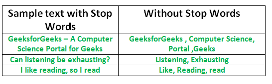

# Stop words

**Learning objectives:**

-   Investigate what a stop word list is,
-   Identify and use off-the-shelf stopwords 
-   Create your own stopwords


##  What are stop-words

- Previous chapter discuss tokenization.

- It turns out not all words carry the same amount of information.

- So, we need to pre-process our data and remove those words with little or no information

```{r 03-stopwords-intro, echo=FALSE, out.width = "100%", message=TRUE, warning=FALSE, paged.print=FALSE}


```

> The process of converting data to something a computer can understand is referred to as pre-processing. One of the major forms of pre-processing is to filter out useless data. In natural language processing, useless words (data), are referred to as stop words.


## Why do we remove them

- Stopwords take up space and valuable processing time. 

- For this, we can remove them easily, it can be regarded as a dimensionality reduction of text data.

- Does it make sense in all NLP task to remove stopwords?


## When stopwords removal make sense?

-  Removal of stopwords depends on the task you are solving.      

- There is no hard and fast rule on when to remove stop words. But we should remove stop words if our task is one of Language Classification, Spam Filtering, Caption Generation, Auto-Tag Generation, Sentiment analysis, or something that is related to text classification

- On the other hand, if our task is one of Machine Translation, Question-Answering problems, Text Summarization, Language Modeling, it’s better not to remove the stop words as they are a crucial part of these applications


- **Less complex Model**: Stop words do not carry meaning on their own, but only in the context of a sentence. If you use a model (a linear classifier, decision tree/forest) that is in principle incapable of leveraging the context, keeping the stop words cannot actually help. 

- **Complex Model** : But, if you use more complex models (LSTM, Transformers) that can grasp the grammatical meaning of the stopwords, it does not make sense to remove them.


- Sentiment analysis task is sensitive to stop words (e.g., David is not happy vs (David, Happy))

- So, what kind of stopwords to inlude depend on the task at hand?

- it’s better to keep these words and do some tests with and without them to see how it affects the model and you should never remove stop words without thinking about the impact of these words on the problem you are trying to solve.


##  Using off-the-shelf stop word lists

-  A quick option for using stop words is to get a list that has already been created.

- There are many lits available, but not all lists are created equal

- Quanteda provides multilingual stopwords

```{r 03-stopwords-sources, message=FALSE, warning=FALSE}
library(quanteda)
stopwords::stopwords_getsources()
```

- Get languages supported by a stopwords

```{r 03-snowball}
stopwords::stopwords_getlanguages("snowball")
```

```{r 03-nltk}
stopwords::stopwords_getlanguages("nltk")
```

```{r 03-iso}
stopwords::stopwords_getlanguages("stopwords-iso")
```

- Default stopword in Quanteeda is snowball. Why?


```{r 03-source-comparisons}
length(stopwords::stopwords(source = "smart"))
length(stopwords::stopwords(source = "snowball"))
length(stopwords::stopwords(source = "stopwords-iso"))
```


- These stopwords do intersect

- Bt, words that appear in Snowball and ISO but not in the SMART list.

```{r 03-snowball-vs-smart}
setdiff(stopwords(source = "snowball"),
        stopwords(source = "smart"))
```

## Stop word removal in R


```{r 03-fir, message=FALSE, warning=FALSE}
library(hcandersenr)
library(tidyverse)
library(tidytext)

fir_tree <- hca_fairytales() %>%
  filter(book == "The fir tree",
         language == "English")

fir_tree
```

```{r 03-tidy-fir}
tidy_fir_tree <- fir_tree %>%
  unnest_tokens(word, text)

tidy_fir_tree
```
- Stopwords that return vector

```{r 03-fir-filter, message=FALSE, warning=FALSE}
tidy_fir_tree %>%
  filter(!(word %in% stopwords(source = "snowball")))
```

- If we use the get_stopwords() function from tidytext instead, then we can use the anti_join() function.


```{r 03-fir-antijoin}
tidy_fir_tree %>%
  anti_join(get_stopwords(source = "snowball"))
```

- It is perfectly acceptable to start with a premade word list and remove or append additional words according to your particular use case.


```{r 03-columnize-setup, include=FALSE}
library(shiny)

columnize <- function(words, ncol = 5,
                      style = "p { font-family:'Roboto Condensed';font-size:12pt;line-height:12.5pt;padding:0;margin:0}") {

  tagList(
    tags$style(style),
    tags$div(
      words %>%
        map(tags$p) %>%
        tagList(),
      style = sprintf("column-count:%d", as.integer(ncol))
    )
  )

}
```


- adding to the built-in stopword list

```{r 03-toks}
toks <- tokens("The judge will sentence Mr. Adams to nine years in 
               prison", remove_punct = TRUE)
toks
```

- adding : "will", "mr", "nine"

```{r 03-additional-stops}
tokens_remove(toks, c(stopwords("english"), "will", "mr", "nine"))
```

## Creating your own stop words list

- We can create our own stopwords using monolingual corpus
- Monolingual corpus Vs Multilingual 
- Using Fir-Tree dataset, let’s take the words and rank them by their count or frequency.

```{r 03-columnize-output, eval=knitr:::is_html_output(), echo=TRUE, results='markup'}
tidy_fir_tree %>%
  count(word, sort = TRUE) %>% 
  slice(1:120) %>% 
  mutate(word = paste0(row_number(), ": ", word)) %>%
  pull(word) %>% 
  columnize()
```

- this has "three" as stopwords which does not make sense.
- How can we solve this issue?
  -Use large corpus will give a descent one
  Use multiple genre subject-specific corpus. Stopwords can then be intersection of stopwords in each corpus.
  Leveraging languages speakers and domain expert
 
 
```{r 03-yo1, message=FALSE, warning=FALSE}
yo <- read_csv("https://raw.githubusercontent.com/Niger-Volta-LTI/yoruba-text/master/Alabi_YorubaTwi_Embedding/alakowe.txt", col_names = FALSE) %>% 
  select(1) %>% 
  rename(text = 1)

# Mean Frequency
yo1_stop_mean <-  yo %>%
  unnest_tokens(word, text) %>%
  count(word, sort = TRUE) %>% 
  mutate(mean_frequency = n/nrow(yo)) %>% 
  mutate(rank_freq = row_number()) %>% 
  filter(n >2) %>% 
  select(word) %>% 
  slice(1:20)

yo1_stop_mean 
```
 


```{r 03-yo2, message=FALSE, warning=FALSE}
yo_two <- read_csv("https://raw.githubusercontent.com/Niger-Volta-LTI/yoruba-text/master/Alabi_YorubaTwi_Embedding/edeyorubarewa.txt", col_names = FALSE)%>% 
  select(1) %>% 
  rename(text = 1)

# Mean Frequency
yo_two_stop <-  yo_two %>%
 unnest_tokens(word, text) %>%
  count(word, sort = TRUE) %>% 
  mutate(mean_frequency = n/nrow(yo_two)) %>% 
  mutate(rank_freq = row_number()) %>% 
  filter(n >2) %>% 
  select(word) %>%
  slice(1:20)
  
yo_two_stop
```


```{r 03-yo-comparison}
intersect(yo_two_stop,yo1_stop_mean) 
```

## Stopwords for Pidgin

-  Pidgin is an English-based creole language spoken as a lingua franca 

-  Nigerian Pidgin (Naija) is an English-based creole language spoken across Nigeria

- For example, "Dis food sweet well, well/Dis food sweet no be smal" in Pidgin English translates to "This meal is delicious"


```{r 03-wiktionary, message=FALSE, warning=FALSE}
dic <- enframe(read_rds("data/wiktionary_words.rds")) %>% 
  rename(words = value) %>% 
  mutate(word = str_extract_all(words, boundary("word")) ) %>% 
  unnest(word) %>% 
  select(word) %>% 
  arrange(word) 
```

```{r 03-pidgin, message=FALSE, warning=FALSE}
Piding <- read_tsv("https://raw.githubusercontent.com/keleog/PidginUNMT/master/corpus/monolingual/pidgin_corpus.txt", col_names = FALSE) %>% 
  rename(text = 1)

Piding %>%
  unnest_tokens(word, text) %>%
  count(word, sort = TRUE) %>% 
  mutate(mean_frequency = n/nrow(Piding)) %>% 
  mutate(rank_freq = row_number()) %>% 
  filter(n >2) %>% 
  select(word) %>% 
  head(10)


```


```{r 03-pidgin-antijoin}
Piding %>%
  unnest_tokens(word, text) %>%
  count(word, sort = TRUE) %>% 
  mutate(mean_frequency = n/nrow(Piding)) %>% 
  mutate(rank_freq = row_number()) %>% 
  filter(n >2) %>% 
  select(word)%>% 
  anti_join(dic) %>% 
  head(10)
```


##  How many words do we include in our stop word list?

- It can be difficult to determine a priori how many different “meaningless” words appear in a corpus. 

- But, Start with a low number like 20 and increase by 10 words until you get to words that are not appropriate as stop words for your analytical purpose.

> There’s no universal stop words list because a word can be empty of meaning depending on the corpus you are using or on the problem you are analysing


## All stop word lists are context-specific

- Context is important in text modeling, so it is important to ensure that the stop word lexicon you use reflects the word space that you are planning on using it in

- On the other hand, sometimes you will have to add in words yourself, depending on the domain.


## Problem with off-the-shelf stopwords

- Most premade stop word lists assume that all the words are spelled correctly.

- Handling misspellings when using premade lists can be done by manually adding common misspellings

- Manually and automatically (Chinese has both and non has been accepted as a standard). 


<!-- - UpSet visualizes set intersections in a matrix layout and introduces aggregates based on groupings and queries. -->


<!-- ```{r  echo=FALSE, fig.cap= "Set intersections for three common stop word lists visualized as an UpSet plot"} -->
<!-- library(UpSetR) -->
<!-- fromList(list(smart = stopwords(source = "smart"), -->
<!--               snowball = stopwords(source = "snowball"), -->
<!--               iso = stopwords(source = "stopwords-iso"))) %>% -->
<!--   upset(empty.intersections = "on") -->
<!-- ``` -->

<!-- NLTK -->
<!-- ```{r} -->
<!-- library() -->

<!-- # importing NLTK libarary stopwords  -->
<!-- import nltk -->
<!-- from nltk.corpus import stopwords -->
<!-- nltk.download('stopwords') -->
<!-- nltk.download('punkt') -->
<!-- from nltk.tokenize import word_tokenize -->

<!-- print(stopwords.words('english')) -->

<!-- # random sentecnce with lot of stop words -->
<!-- sample_text = "Oh man, this is pretty cool. We will do more such things." -->
<!-- text_tokens = word_tokenize(sample_text) -->

<!-- tokens_without_sw = [word for word in text_tokens if not word in stopwords.words('english')] -->

<!-- print(text_tokens) -->
<!-- print(tokens_without_sw) -->

<!-- ``` -->


<!-- # Gensim -->
<!-- ```{r} -->
<!-- from gensim.parsing.preprocessing import remove_stopwords -->

<!-- sample_text = "Oh man, this is pretty cool. We will do more such things." -->
<!-- sample_text_NSW = remove_stopwords(text) -->

<!-- print(word_tokenize(sample_text)) -->
<!-- print(word_tokenize(sample_text_NSW)) -->
<!-- ``` -->


## Meeting Videos

### Cohort 1

`r knitr::include_url("https://www.youtube.com/embed/URL")`

<details>

<summary>

Meeting chat log

</summary>

    LOG

</details>
